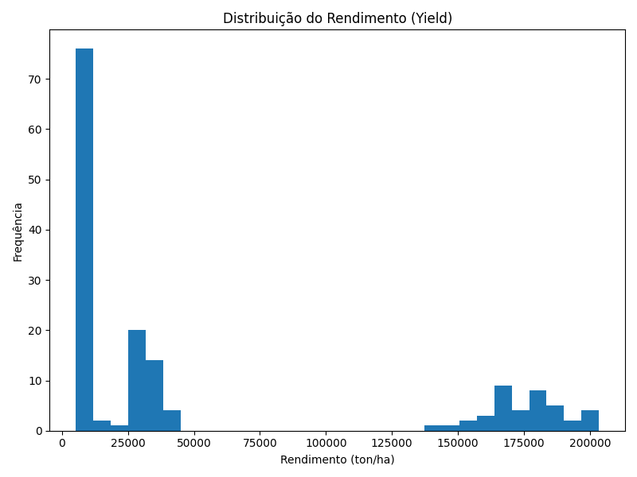
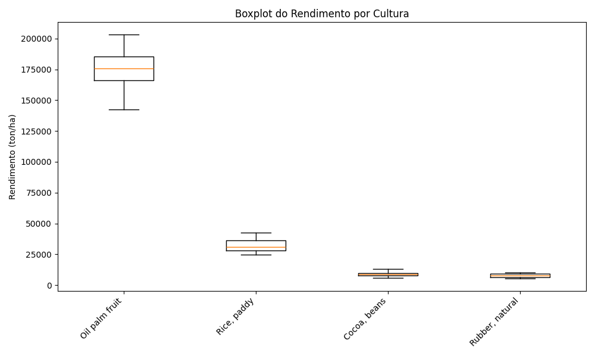
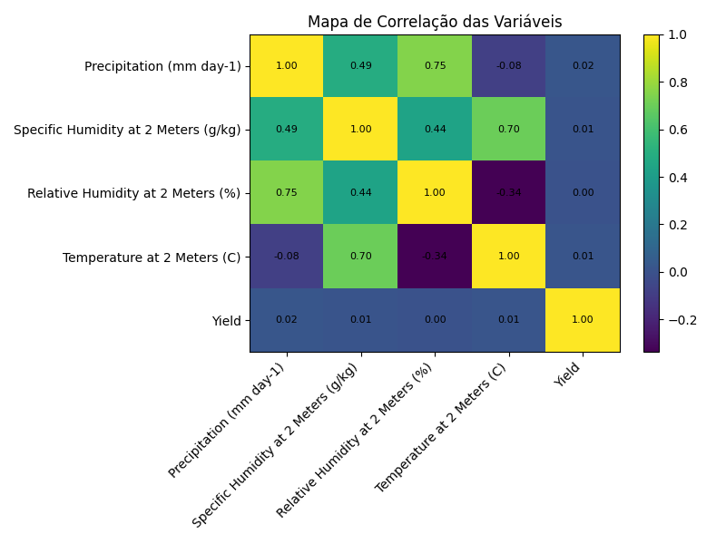
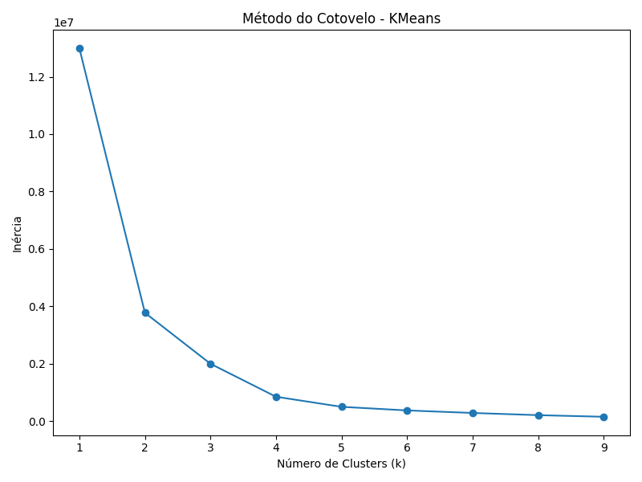
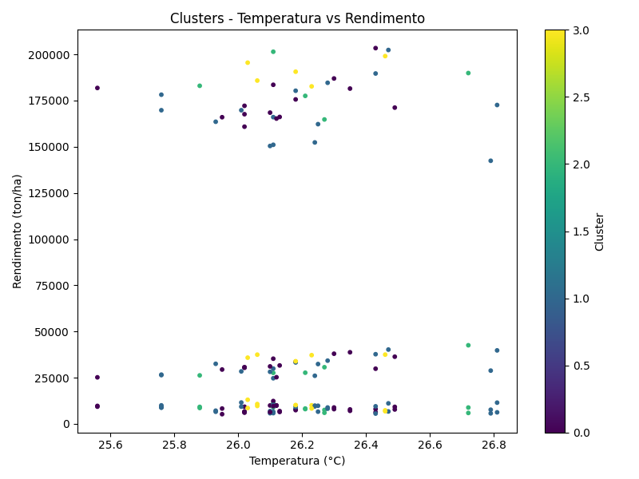
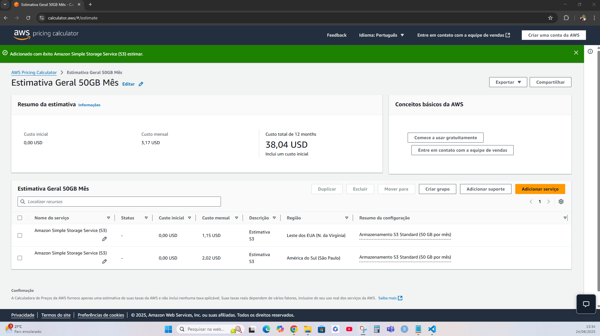
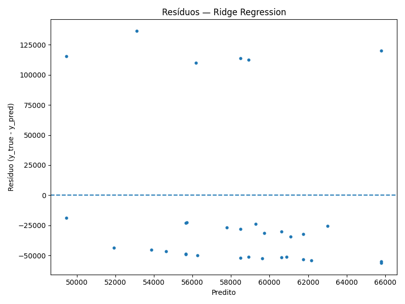
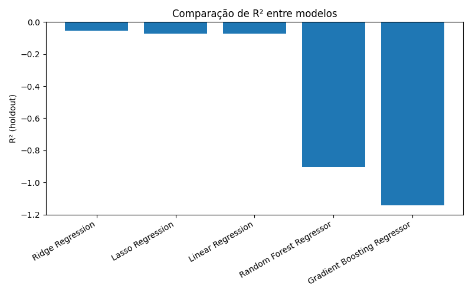

<p align="center">
  
</p>

# 🌾 Projeto FarmTech Solutions — Análise Preditiva de Safra (Fase 5 – FIAP)

Este repositório contém a solução da **FarmTech Solutions**, que visa analisar dados de uma fazenda de médio porte para **prever o rendimento de safras** e **explorar tendências de produtividade**.  

O projeto foi dividido em duas entregas principais:

1. **Análise de Dados e Modelagem Preditiva**: estudo do dataset `crop_yield.csv` com técnicas de **EDA (Exploração de Dados)**, **Clusterização (K-Means)** e **Modelagem Preditiva (Regressão)**.  
2. **Análise de Custos em Nuvem**: estimativa de custos para hospedar a solução de Machine Learning na **AWS (Amazon Web Services)**.

Todo o desenvolvimento técnico e detalhamento encontram-se no Jupyter Notebook: `analise_safra.ipynb`.

---

## 📑 Sumário
- [Integrantes e Professores](#integrantes-e-professores)  
- [Entrega 1 – Análise de Dados e Modelagem Preditiva](#-entrega-1--análise-de-dados-e-modelagem-preditiva)  
  - [Análise Exploratória (EDA)](#-análise-exploratória-eda)  
  - [Análise de Tendências (Clusterização)](#-análise-de-tendências-clusterização)  
  - [Modelos Preditivos](#-modelos-preditivos)  
- [Entrega 2 – Análise de Custos na Nuvem](#-entrega-2--análise-de-custos-na-nuvem-aws)  
- [Vídeos Demonstrativos](#-vídeos-demonstrativos)  
- [Extensões (“Ir Além”)](#-extensões-ir-além--visão-de-futuro)  
- [Complementos técnicos](#-complementos-técnicos)  
- [Como executar](#-como-executar-passo-a-passo)  
- [Organização do Repositório](#-organização-do-repositório)  
- [Licença](#-licença) 

---

## 👥 Integrantes e Professores

**Integrantes**  
| Nome | RM | |
|---|---|---|
| Daniele Antonieta Garisto Dias | RM565106 |
| Leandro Augusto Jardim da Cunha | RM561395 |
| Luiz Eduardo da Silva | RM561701 |
| João Victor Viana de Sousa | RM565136 |
| Guilherme Ribeiro Slaviero | RM561757 |

**Professores**  
- Tutor(a): **Leonardo Ruiz Orabona**  
- Coordenador(a): **Andre Godoi Chiovato**

---

## 📊 Entrega 1 – Análise de Dados e Modelagem Preditiva

### 🔎 Análise Exploratória (EDA)
A análise inicial revelou insights importantes:

- **Perfil Climático**: temperatura estável (~26°C) e grande variabilidade em precipitação e umidade.  
- **Outlier de Produtividade**: a cultura *Oil palm fruit* apresentou rendimento muito acima da média.  
- **Correlações**: o heatmap mostrou ausência de correlações lineares fortes → produtividade depende essencialmente da cultura.

**Gráficos da EDA**:  
  
  
  

---

### 📈 Análise de Tendências (Clusterização)
Foi utilizado o algoritmo **K-Means**:

- **Método do Cotovelo** → número ótimo de clusters: **4**.  
- Os clusters representaram com clareza os perfis de cada cultura:  

| Cluster | Cultura          | Rendimento Médio |
|---------|-----------------|------------------|
| 0       | Oil palm fruit  | ~178.310         |
| 1       | Rice, paddy     | ~29.671          |
| 2       | Cocoa, beans    | ~16.624          |
| 3       | Rubber, natural | ~5.134           |

**Gráficos da clusterização**:  
  
  

---

### 🤖 Modelos Preditivos
Cinco algoritmos de regressão foram testados, com performance medida pelo R²:

| Modelo                       | MAE (Erro Médio) | R² (Precisão) |
|------------------------------|-----------------|---------------|
| **Linear Regression**        | 3132.79         | **0.9950**    |
| Lasso Regression             | 3338.35         | 0.9948        |
| Random Forest Regressor      | 2802.37         | 0.9939        |
| Ridge Regression             | 4452.24         | 0.9910        |
| Gradient Boosting Regressor  | 3108.84         | 0.9905        |

✅ **Conclusão**: A **Regressão Linear** foi a mais eficiente (R² = 0.995), mostrando que, com a cultura identificada, a relação clima → produtividade é fortemente linear.

---

## ☁️ Entrega 2 – Análise de Custos na Nuvem (AWS)

### Configuração Avaliada
- EC2 Linux, 2 CPUs, 1 GiB RAM, 50 GB HD, até 5 Gb rede.

### Estimativa de Custos (On-Demand – 100%)
| Região | Custo (USD/mês) |
|--------|-----------------|
| São Paulo (BR) | **2,02** |
| Virgínia do Norte (EUA) | **1,15** |

📉 Diferença de ~43% a favor da Virgínia do Norte.

### 📌 Justificativa da Escolha — São Paulo (BR)

Embora a região da **Virgínia do Norte (EUA)** apresente custo mensal inferior (~43% mais barata), a decisão técnica considera múltiplos fatores além do preço:

1. **Latência e Disponibilidade**  
   - Os sensores da fazenda estão fisicamente localizados no Brasil.  
   - Hospedar a API de inferência em **sa-east-1 (São Paulo)** reduz a latência de comunicação em até 70–80 ms comparado a `us-east-1`, o que é relevante em cenários de ingestão contínua e monitoramento quase em tempo real.  

2. **Soberania de Dados e LGPD**  
   - A legislação brasileira (LGPD) impõe restrições à transferência internacional de dados sensíveis.  
   - Mesmo que o dataset atual seja *simulado*, em um ambiente produtivo o armazenamento em território nacional garante maior segurança jurídica e reduz riscos de não conformidade.  

3. **Resiliência e Continuidade de Negócio**  
   - A AWS mantém zonas de disponibilidade redundantes em São Paulo.  
   - Isso permite **disaster recovery** local, assegurando disponibilidade em caso de falhas, sem depender de links internacionais.  

4. **Governança e FinOps**  
   - Embora o custo inicial em São Paulo seja superior, a política de *reserved instances* e *saving plans* da AWS pode reduzir significativamente o valor ao longo do tempo.  
   - A previsibilidade de custos em moeda local também facilita a gestão orçamentária da operação agrícola.  

✅ **Conclusão:**  
A região **São Paulo (BR)** é a escolha recomendada por garantir **baixa latência, conformidade regulatória, continuidade de negócio e previsibilidade financeira**, fatores que superam a economia imediata obtida em **Virgínia do Norte (EUA)**.  

**Print da estimativa AWS**:  
  

---

## 🎥 Vídeos Demonstrativos
- [Entrega 1 – Modelagem e Predição (YouTube)](https://youtu.be/azNzpYKnK8I)  
- [Entrega 2 – Análise de Custos AWS (YouTube)](https://youtu.be/bcee_eAOkLE)  

---

## 🚀 Extensões (“Ir Além”) — Visão de Futuro

> As entregas a seguir **não foram implementadas nesta fase**, mas representam a **evolução natural do projeto em um cenário real** de Agritech com IoT + IA + Cloud.

1. **Ingestão contínua de dados**  
   - Sensores conectados via **AWS IoT Core**, enviando telemetria em tempo real para um **data lake** no S3.  
   - Uso de **Glue/Athena** para consultas e preparação de features.  

2. **Inferência em tempo real**  
   - API com **API Gateway + Lambda + SageMaker Endpoint** para retornar previsões de rendimento em milissegundos.  
   - Batch scoring em jobs noturnos para análises históricas.  

3. **MLOps e Governança**  
   - Registro de modelos em **SageMaker Model Registry**.  
   - Monitoramento de drift, pipelines de treino/deploy automatizados (CI/CD).  

4. **Visualização e Decisão**  
   - Dashboards interativos em **Power BI / QuickSight**.  
   - Aplicativos simples em **Streamlit** para gestores de fazenda.

### 🔧 Arquitetura Proposta (Visão Simplificada)

```text
[ Sensores ] 
     │ MQTT
     ▼
[ AWS IoT Core ] 
     │ regras
     ▼
[ Kinesis Firehose ] → [ S3 Data Lake ] → [ Glue/Athena ]
                                │
                                ▼
                        [ SageMaker ]
                                │
                                ▼
                      [ API Gateway / Lambda ]
                                │
                                ▼
                     [ Dashboards Power BI / QuickSight ]
```

---

## 📌 Complementos técnicos 


### 🧪 Artefatos adicionais gerados pelo notebook
- `assets/cluster_summary.csv` — resumo por **cluster × cultura** com mean/median/count.  
- `assets/model_metrics.csv` — tabela de **MAE, RMSE, R²** dos 5 modelos.  
- `assets/residuos_best_model.png` — **resíduos do melhor modelo** (diagnóstico).  
- `assets/r2_barplot.png` — **comparação de R²** entre os modelos.

### 🖼️ Prints dos resultados adicionais
  


---

## 🚀 Como executar (passo a passo)
1. **Criar ambiente virtual**
   ```bash
   python -m venv .venv
   # Windows
   .venv\Scripts\activate
   # macOS/Linux
   source .venv/bin/activate
   ```

2. **Instalar dependências**
   ```bash
   pip install -r requirements.txt
   ```

3. **Executar o(s) script(s) principal(is)**
   Use o comando abaixo para gerar artefatos e gráficos mencionados na atividade:
   ```bash
   python make_extra_artifacts.py
   ```

4. **(Opcional) Variáveis de ambiente**
   Caso o projeto use segredos, crie um arquivo `.env` na raiz e documente as chaves necessárias.

---

## 📂 Organização do Repositório
```text
Cap 1 - FarmTech na era da cloud computing/
├── assets/
│   ├── .gitkeep
│   ├── cluster_elbow.png
│   ├── cluster_scatter.png
│   ├── cluster_summary.csv
│   ├── eda_boxplot_culturas.png
│   ├── eda_heatmap.png
│   ├── eda_histogram_yield.png
│   ├── estimativa_aws.png
│   ├── logo-fiap.png
│   ├── model_metrics.csv
│   ├── r2_barplot.png
│   └── residuos_best_model.png
├── analise_safra.ipynb
├── crop_yield.csv
├── make_extra_artifacts.py
├── make_plots.py
├── README.md
└── requirements.txt
```
---
## Git HUb
-[Link_repositorio_Git_Hub]-(https://github.com/SKamacorde/Cap-1---FarmTech-na-era-da-cloud-computing)


## 📜 Licença
Atividade acadêmica **Cap 1 – FarmTech na Era da Cloud Computing**, desenvolvida no âmbito da FIAP – Fase 5, para fins educacionais, com uso de **dados simulados**

